# Screen and Navigation Inventory

## Entry and Auth Flow

| Screen | Type | Layout | Purpose | Main Navigation |
|---|---|---|---|---|
| `SplashActivity` | Activity, launcher/exported | `activity_splash` | Shows app version, waits 2 seconds, routes by secure token and stored role. | No token/user -> `LoginActivity`; employee -> `DashboardActivity`; other roles -> `SharedDashboardActivity`. |
| `LoginActivity` | Activity | `activity_login` | Password login, OTP login, FCM token registration, location lookup helper. | Success -> employee/admin shell; forgot password -> `ForgotPasswordActivity`; OTP bottom sheets. |
| `ForgotPasswordActivity` | Activity | `activity_forgot_password` | Forgot-password flow. | Opens OTP bottom sheet and new password flow. |
| `NewPasswordActivity` | Activity | `activity_new_password` | New password creation/reset screen. | Returns to auth flow. |
| `RequestOtpBottomSheet` | Bottom sheet | `bottom_sheet_request_otp` | Collects email for OTP login. | Calls `request-otp`. |
| `GetOTPBottomSheetDialog` | Bottom sheet | `bottom_sheet_dialog_get_otp` | Collects OTP and supports resend. | Calls `verify-otp` / `request-otp`. |

## Employee Shell

| Screen | Type | Layout | Purpose | Main Navigation |
|---|---|---|---|---|
| `DashboardActivity` | Activity | `activity_dashboard` | Drawer host and app update/battery optimization handling. | Hosts `mobile_navigation`; logout -> `LoginActivity`; theme picker. |
| `DashboardFragment` | Nav fragment | `fragment_dashboard` | Employee home, day check-in/out, announcements action, current location action, dashboard tabs. | Tabs: attendance status, targets, projects; apply leave -> `ApplyLeaveActivity`; announcements -> `AnnouncementsActivity`. |
| `AttendanceStatusFragment` | Tab fragment | `fragment_attendance_status` | Calendar/status summary for attendance. | Opens attendance details/work details by date. |
| `MyTargetsFragment` | Tab fragment | `fragment_my_targets` | Employee monthly targets. | Uses budget target API. |
| `ProjectDashboardFragment` | Tab fragment | `fragment_project_dashboard` | Project budget/status dashboard. | Uses my-projects budget API. |
| `ThemePickerBottomSheet` | Bottom sheet | custom/dialog layout | Theme and dark-mode preference picker. | Saves unencrypted theme prefs. |

## Employee Drawer Destinations

| Drawer Item / Fragment | Type | Layout | Current Behavior |
|---|---|---|---|
| Dashboard / `DashboardFragment` | Nav fragment | `fragment_dashboard` | Active. |
| Work management / `AttendanceFragment` | Nav fragment | `fragment_attendance` | Active. Lists assigned work, search, filters, pagination, self sign-in, progress, task details. |
| Reimbursement / `ReimbursementFragment` | Nav fragment | `fragment_reimbursement` | Active. Lists all claims, paginated; opens claim details; creates claims. |
| Vendor / `VendorFragment` | Nav fragment | `fragment_vendor` | Declared, but `DashboardActivity` intercepts drawer click and shows "under development". |
| Cab / `CabFragment` | Nav fragment | `fragment_cab` | Declared, but `DashboardActivity` intercepts drawer click and shows "under development". |
| Material reco / `PurchaseFragment` | Nav fragment | `fragment_purchase` | Declared, but `DashboardActivity` intercepts drawer click and shows "under development". |
| About / `AboutFragment` | Nav fragment | `fragment_about` | Declared, but `DashboardActivity` intercepts drawer click and shows "under development". |
| Feedback / `FeedbackFragment` | Nav fragment | `fragment_feedback` | Declared, but `DashboardActivity` intercepts drawer click and shows "under development". |

## Attendance and Work Management

| Screen | Type | Layout | Purpose | Main Navigation |
|---|---|---|---|---|
| `AttendanceFragment` | Fragment | `fragment_attendance` | Assigned work list with search/filter/pagination; sign-in actions; progress actions. | Add sign-in -> `AddSignInActivity`; progress -> `MyProgressActivity`; task -> `AssignedTaskDetailActivity`; sign-in detail -> `SignInDetailActivity`. |
| `AddSignInActivity` | Activity | `activity_add_sign_in` | Self-assign/sign-in work creation. | Fetches clients/projects/PO/circle/site/type/activity lists; submits self assignment. |
| `AssignedTaskDetailActivity` | Activity | `activity_assigned_task_detail` | Detail for assigned work, start/end work, material usage. | Start work bottom sheet; end work bottom sheet; returns status update. |
| `StartWorkBottomSheet` | Bottom sheet | `bottom_sheet_start_work` | Captures/upload photo and location for work start. | Sends multipart `work/start`. |
| `EndWorkBottomSheet` | Bottom sheet | `bottom_sheet_end_work` | Ends work with status, location, optional material usage. | Opens `MaterialUsageActivity`; sends `work/end`. |
| `MaterialUsageActivity` | Activity | `activity_material_usage` | Inventory/material usage selection for work completion. | Uses `inventory/by-project/{project_id}`; returns selected material. |
| `MyProgressActivity` | Activity | `activity_my_progress` | Employee progress list. | Opens `ProgressDetailsActivity`. |
| `ProgressDetailsActivity` | Activity | `activity_progress_details` | Progress detail display. | Back only. |
| `SignInDetailActivity` | Activity | `activity_sign_in_detail` | Sign-in detail placeholder/detail screen. | Back only. |
| `AttendanceDetailActivity` | Activity | `activity_attendance_detail` | Attendance details by month/year and records. | Opens task detail. |
| `WorkDetailsByDateActivity` | Activity | `activity_work_details_by_date` | Work details for a selected date. | Back only. |
| `ApplyLeaveActivity` | Activity | `activity_apply_leave` | Apply leave with optional attachment. | Uses multipart `attendance/apply-leave`. |
| `ApprovalsActivity` | Activity | `activity_approvals` | Attendance/work approval list. | Admin/approval workflow. |

## Reimbursement

| Screen | Type | Layout | Purpose | Main Navigation |
|---|---|---|---|---|
| `ReimbursementFragment` | Fragment | `fragment_reimbursement` | Claim list, pagination, swipe refresh. | Create -> `CreateClaimActivity`; item -> `ClaimDetailActivity`. |
| `CreateClaimActivity` | Activity | `activity_create_claim` | Create multi-part reimbursement claim with sites and expense entries. | Opens travel/site/expense entry screens and bottom sheets; submits multipart `claim/create-claim`. |
| `ClaimDetailActivity` | Activity | `activity_claim_detail` | Claim details with expenses/sites. | Back only. |
| `MyClaimsActivity` | Activity | `activity_my_claims` | My claims list. | Opens `MyClaimDetailsActivity`. |
| `MyClaimDetailsActivity` | Activity | `activity_my_claim_details` | My claim detail screen. | Back only. |
| `ClaimApprovalsActivity` | Activity | `activity_claim_approvals` | Claim approvals list. | Opens `ClaimApprovalsDetailsActivity`. |
| `ClaimApprovalsDetailsActivity` | Activity | `activity_claim_approvals_details` | Claim approval details. | Back only. |
| `AddTravelingDetailActivity` | Activity | `activity_add_traveling_detail` | Add travel expense details and attachments. | Returns expense payload to create-claim flow. |
| `AddMutilSiteDetailsActivity` | Activity | `activity_add_mutil_site_details` | Add multiple site details. | Returns to create-claim flow. |
| `EnterDaBottomSheet` | Bottom sheet | `bottom_sheet_enter_da` | Add DA expense. | Returns DA expense entry. |
| `EnterOthersBottomSheet` | Bottom sheet | `bottom_sheet_enter_others` | Add other expense. | Returns other expense entry. |
| `SiteSelectionBottomSheetDialog` | Bottom sheet | item/site layouts | Select claim sites. | Returns selected sites. |

## Admin / Non-Employee Shell

| Screen | Type | Layout | Purpose | Main Navigation |
|---|---|---|---|---|
| `SharedDashboardActivity` | Activity | `activity_shared_dashboard` | Non-employee/admin dashboard with attendance day start/end, sites, approvals, apply leave, theme, logout, current location. | Sites -> `SitesActivity`; site approvals -> `WorkSitesApprovalActivity`; apply leave -> `ApplyLeaveActivity`; logout -> `LoginActivity`. |
| `SitesActivity` | Activity | `activity_sites` | Paginated all-sites list. | Add site -> `AddSiteActivity`. |
| `AddSiteActivity` | Activity | `activity_add_site` | Site creation. | Uses client/project/PO/circle APIs and `site/create`. |
| `WorkSitesApprovalActivity` | Activity | `activity_work_sites_approval` | Select/inspect work sites needing approval. | Opens `WorkSitesActivity`. |
| `WorkSitesActivity` | Activity | `activity_work_sites` | Work sites for employee/date. | Opens `SiteWorkDetailActivity`. |
| `SiteWorkDetailActivity` | Activity | `activity_site_work_detail` | Work-site progress approval details. | Approves via `work/approve`; returns result. |

## Vendor, Cab, Announcements, Misc

| Screen | Type | Layout | Purpose | Main Navigation |
|---|---|---|---|---|
| `AnnouncementsActivity` | Activity | `activity_announcements` | Announcements list/display. | Opened from dashboard. |
| `VendorFragment` | Fragment | `fragment_vendor` | Vendor entry point, currently blocked from drawer. | Likely opens vendor activity flow when enabled. |
| `VendorStartActivity` | Activity | `activity_vendor_start` | Vendor start activity form. | Opens login/details/view-all flows. |
| `VendorLoginDetailsActivity` | Activity | `activity_vendor_login_details` | Vendor login details. | Back only. |
| `ViewAllVendorActivity` | Activity | `activity_view_all_vendor` | View all vendor activity list. | Opens `VendorDetailsActivity`. |
| `VendorDetailsActivity` | Activity | `activity_vendor_details` | Vendor details. | Back only. |
| `CabFragment` | Fragment | `fragment_cab` | Cab entry point, currently blocked from drawer. | Likely opens cab fare flow when enabled. |
| `AddCabFareActivity` | Activity | `activity_add_cab_fare` | Cab fare with location and image attachment. | Uses camera/gallery and location. |
| `FeedbackFragment` | Fragment | `fragment_feedback` | Feedback placeholder. | Drawer item blocked. |
| `AboutFragment` | Fragment | `fragment_about` | About placeholder. | Drawer item blocked. |

## Navigation Map

```mermaid
flowchart TD
    Splash["SplashActivity"]
    Login["LoginActivity"]
    Forgot["ForgotPasswordActivity"]
    NewPass["NewPasswordActivity"]
    EmpShell["DashboardActivity"]
    AdminShell["SharedDashboardActivity"]

    Splash -->|no token/user| Login
    Splash -->|employee role| EmpShell
    Splash -->|other role| AdminShell
    Login -->|forgot password| Forgot
    Forgot --> NewPass
    Login -->|login or OTP success, employee| EmpShell
    Login -->|login or OTP success, other role| AdminShell

    EmpShell --> Dash["DashboardFragment"]
    EmpShell --> Attend["AttendanceFragment"]
    EmpShell --> Reimb["ReimbursementFragment"]
    EmpShell -. blocked as under development .-> Vendor["VendorFragment"]
    EmpShell -. blocked as under development .-> Cab["CabFragment"]
    EmpShell -. blocked as under development .-> Material["PurchaseFragment"]
    EmpShell -. blocked as under development .-> About["AboutFragment"]
    EmpShell -. blocked as under development .-> Feedback["FeedbackFragment"]

    Dash --> AttStatus["AttendanceStatusFragment"]
    Dash --> Targets["MyTargetsFragment"]
    Dash --> Projects["ProjectDashboardFragment"]
    Dash --> Announcements["AnnouncementsActivity"]
    Dash --> ApplyLeave["ApplyLeaveActivity"]

    Attend --> AddSignIn["AddSignInActivity"]
    Attend --> MyProgress["MyProgressActivity"]
    Attend --> TaskDetail["AssignedTaskDetailActivity"]
    TaskDetail --> StartWork["StartWorkBottomSheet"]
    TaskDetail --> EndWork["EndWorkBottomSheet"]
    EndWork --> MatUsage["MaterialUsageActivity"]
    MyProgress --> ProgressDetail["ProgressDetailsActivity"]

    Reimb --> CreateClaim["CreateClaimActivity"]
    Reimb --> ClaimDetail["ClaimDetailActivity"]
    CreateClaim --> Travel["AddTravelingDetailActivity"]
    CreateClaim --> MultiSite["AddMutilSiteDetailsActivity"]
    CreateClaim --> ExpenseSheets["DA/Other/Site bottom sheets"]

    AdminShell --> Sites["SitesActivity"]
    Sites --> AddSite["AddSiteActivity"]
    AdminShell --> SiteApprovals["WorkSitesApprovalActivity"]
    SiteApprovals --> WorkSites["WorkSitesActivity"]
    WorkSites --> SiteWorkDetail["SiteWorkDetailActivity"]
    AdminShell --> ApplyLeave
```

